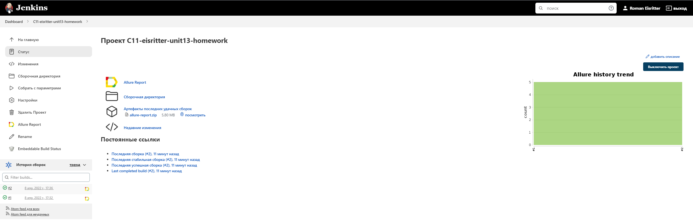
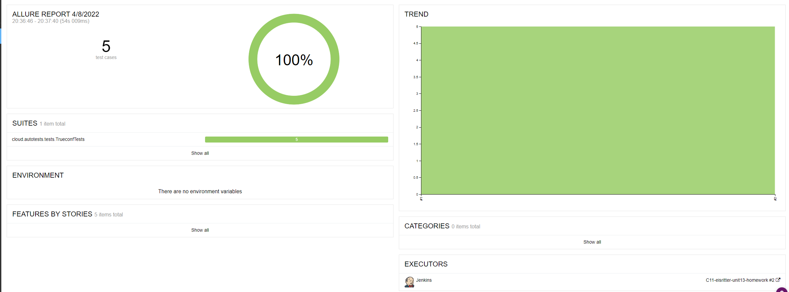
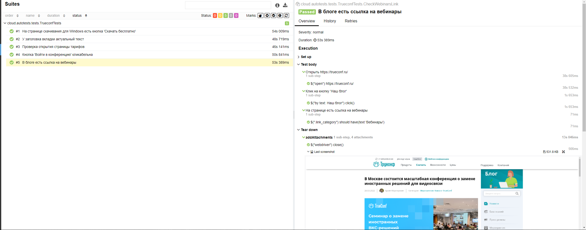

# Проект по автоматизации тестирования для мобильного приложения Wikipedia

## 📃 Содержание:

- [Технологии и инструменты](#computer-технологии-и-инструменты)
- [Реализованные проверки](#boom-Реализованные-проверки)
- [Сборка в Jenkins](#-сборка-в-jenkins)
- [Запуск из терминала](#computer-Запуск-тестов-из-терминала)
- [Отчет в Allure report](#-отчет-в-allure-report)
- [Отчет в Telegram](#-уведомление-в-telegram-при-помощи-бота)
- [Видео пример прохождения тестов](#-видео-пример-прохождения-теста)

## :computer: Технологии и инструменты
<p align="center">


</p>

## :boom: Реализованные проверки

- На странице скачивания для Windows есть кнопка 'Скачать бесплатно'
- У заголовка вкладки верный текст
- Страница тарифов TrueConf Online открывается
- Кнопка 'Войти в конференцию' кликабельна
- На странице блога есть ссылка на вебинары

## </a> Сборка в Jenkins
<a target="_blank" href="https://jenkins.autotests.cloud/job/C11-eisritter-unit13-homework/">Jenkins job</a>
<p align="center">
<a href="https://jenkins.autotests.cloud/job/C11-eisritter-unit13-homework/"></a>
</p>

### :maple_leaf: Параметры сборки в Jenkins:

- browser (браузер, по умолчанию chrome)
- browserSize (размер окна браузера, по умолчанию 1920x1080)
- remoteDriverUrl (логин, пароль и адрес удаленного сервера selenoid или grid)
- threads (количество потоков)
- AlureNotificationVersion (версия AllureNotification)

## :computer: Запуск тестов из терминала

Локальный запуск:
```
gradle clean test
```

Удаленный запуск:
```
clean
test
-Dbrowser=${BROWSER}
-DbrowserVersion=${BROWSER_VERSION}
-DbrowserSize=${BROWSER_SIZE}
-DbrowserMobileView="${BROWSER_MOBILE}"
-DremoteDriverUrl=https://${USER}:${PASSWORD}@${REMOTE_DRIVER_URL}/wd/hub/
-DvideoStorage=https://${REMOTE_DRIVER_URL}/video/
-Dthreads=${THREADS}
```
## </a> Отчет в <a target="_blank" href="https://jenkins.autotests.cloud/job/C11-eisritter-unit13-homework/allure">Allure report</a>

### :lady_beetle: Основное окно

<p align="center">

</p>

### :cherries: Тесты

<p align="center">

</p>

## </a> Уведомление в Telegram при помощи бота

<p align="center">

</p>


## </a> Видео пример прохождения теста

<p align="center">
 
</p>

